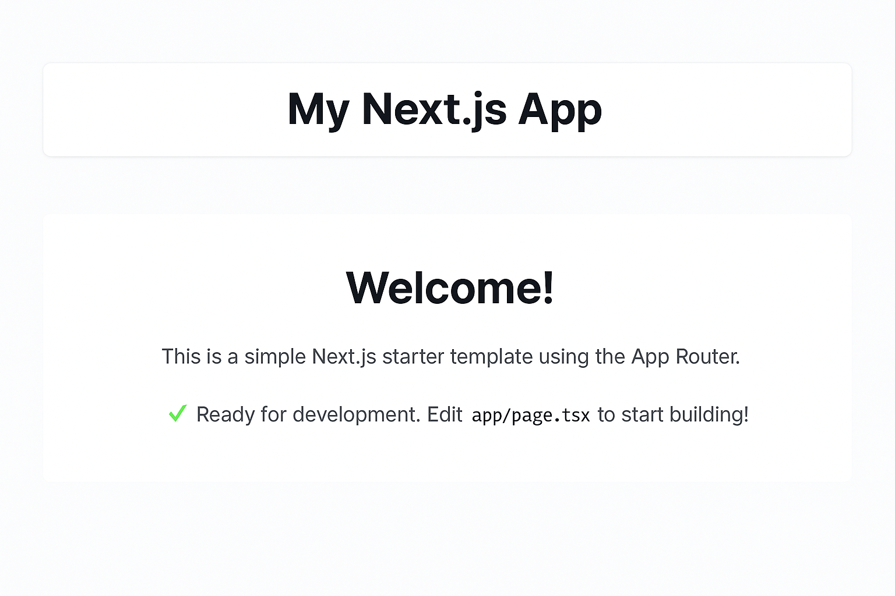
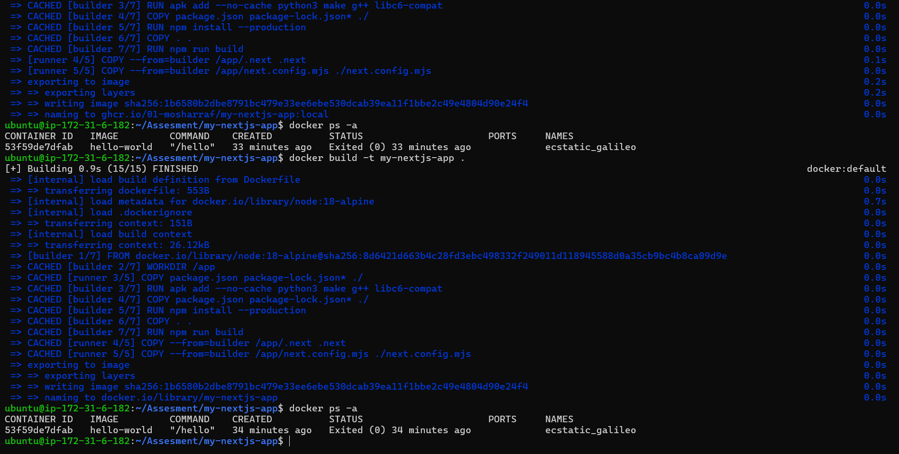
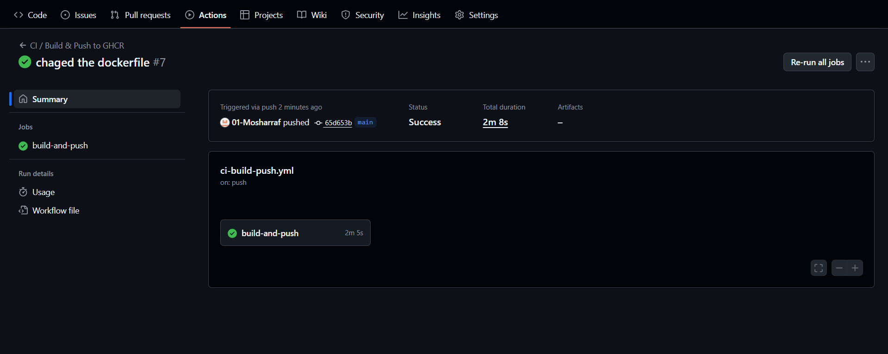

# DevOps Internship Assessment — Next.js Application Deployment

 

## Objective
This project demonstrates how to:
- Containerize a **Next.js application** using Docker  
- Automate Docker image builds and pushes using **GitHub Actions** and **GitHub Container Registry (GHCR)**  
- Deploy the application to **Kubernetes (Minikube)** using manifests  

---

## 🛠️ Tech Stack
- **Next.js** (Frontend Framework)
- **Docker** (Containerization)
- **GitHub Actions** (CI/CD)
- **GitHub Container Registry (GHCR)**
- **Kubernetes / Minikube** (Deployment)

---

## ⚙️ Project Structure

my-nextjs-app/
├── app/
│ ├── page.tsx
│ └── layout.tsx
├── public/
├── Dockerfile
├── .github/
│ └── workflows/
│ └── ci.yml
├── k8s/
│ ├── deployment.yaml
│ └── service.yaml
└── README.md


---

## Local Development

###  Install dependencies
```bash
npm install
```

## Run locally
```bash
npm run dev
```

Docker Setup

Build Docker Image
```bash
docker build -t my-nextjs-app .
```

Run the Container
```bash
docker run -p 3000:3000 my-nextjs-app
```

Then visit: http://localhost:3000
 Dockerfile Explained

Multi-stage Docker build:
```bash
# Builder
FROM node:18-alpine AS builder
WORKDIR /app
RUN apk add --no-cache python3 make g++ libc6-compat
COPY package.json package-lock.json* ./
RUN npm install --production
COPY . .
RUN npm run build

# Runner
FROM node:18-alpine AS runner
WORKDIR /app
COPY package.json package-lock.json* ./
ENV NODE_ENV=production
COPY --from=builder /app/.next .next
COPY --from=builder /app/next.config.mjs ./next.config.mjs
EXPOSE 3000
ENV NODE_ENV=production
CMD ["npx", "next", "start", "-p", "3000"]

```

### Common Build Error
 Error:
failed to calculate checksum ... "/app/public": not found

## Cause:

The public/ folder is missing in your project, but the Dockerfile tries to copy it.

## Fix Options:

Option 1 (Recommended):
Remove this line from your Dockerfile:

COPY --from=builder /app/public ./public


Option 2:
Create a public folder if you plan to use static assets:

mkdir public
echo "test" > public/.gitkeep

## GitHub Actions Workflow
File: .github/workflows/ci.yml

This workflow:
```bash
name: CI / Build & Push to GHCR
on:
  push:
    branches: [ main ]

permissions:
  contents: read
  packages: write

jobs:
  build-and-push:
    runs-on: ubuntu-latest
    steps:
      - uses: actions/checkout@v4

      - name: Set lowercase IMAGE_NAME
        run: |
          echo "IMAGE_NAME=ghcr.io/${OWNER,,}/${REPO,,}" >> $GITHUB_ENV
        env:
          OWNER: ${{ github.repository_owner }}
          REPO: ${{ github.event.repository.name }}

      - name: Set up QEMU
        uses: docker/setup-qemu-action@v3

      - name: Set up buildx
        uses: docker/setup-buildx-action@v3

      - name: Login to GHCR
        uses: docker/login-action@v2
        with:
          registry: ghcr.io
          username: ${{ github.actor }}
          password: ${{ secrets.GITHUB_TOKEN }}

      - name: Build and push
        uses: docker/build-push-action@v5
        with:
          context: .
          push: true
          tags: |
            ${{ env.IMAGE_NAME }}:latest
            ${{ env.IMAGE_NAME }}:sha-${{ github.sha }}
          cache-from: type=gha
          cache-to: type=gha,mode=max


```

# GHCR Authentication (if push fails)

If image push fails due to permission errors:

## Create a Personal Access Token (PAT)

Go to GitHub → Settings → Developer Settings → Personal Access Tokens → Fine-grained Tokens

Scopes required:

write:packages
read:packages
repo (if your repo is private)

## Add PAT as a GitHub Secret

Go to your repo → Settings → Secrets → Actions → New Repository Secret

Name: GHCR_PAT

Value: (paste your token)

Then update the login step in the workflow:

password: ${{ secrets.GHCR_PAT }}

## Deploy to Minikube
### Start Minikube
minikube start

### Apply Kubernetes Manifests
kubectl apply -f k8s/

### Check Status
kubectl get pods
kubectl get svc

### Access the App
minikube service my-nextjs-service

 

 

